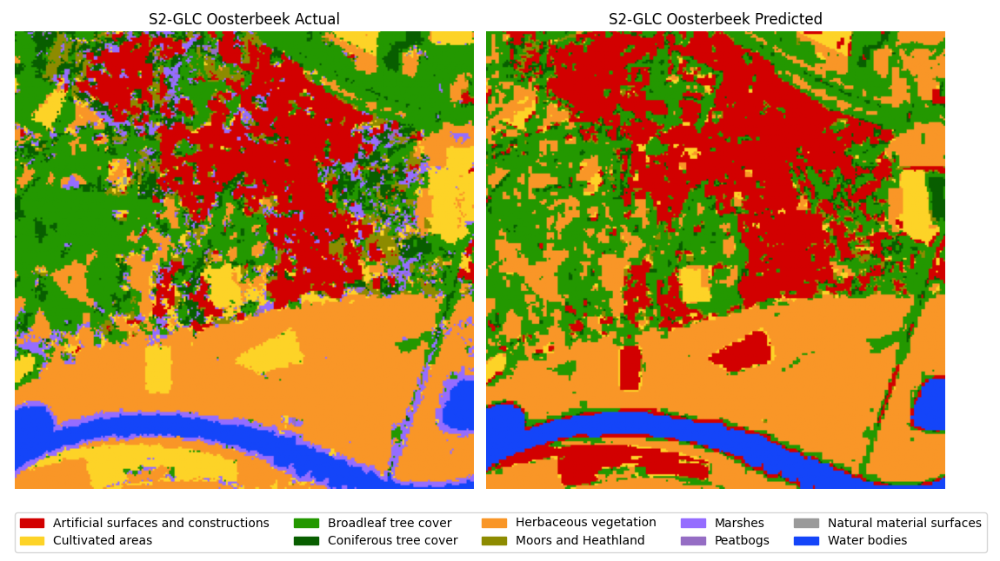

# Welcome to My Portfolio 

Hi, I'm Anthony and this is my personal Geo-Information Science visualization portfolio.

## Projects
- **GIS in Context**
  During the GIS in Context course I worked on a group assignment. We created a storymap about urban heat islands in Houtston, Texas. 
  
<iframe 
  src="https://storymaps.arcgis.com/stories/ce489e2e22ec4f99ad9da8d86ff3ccf0"
  width="100%" 
  height="450px" 
  style="border:none;">
</iframe>   

- **Machine Learning**
  The image underneath is created during a project for the machine learning course. The image is the output from a K-Nearest-Neighbor model (k=15).
  
   

- **Remote Sensing and GIS Integration**
  During the Remote Sensing and GIS Integration course I worked together in a team to work on a project. We collected our own lidar data to create a hiking trail. 
  
<video width="400" controls>
  <source src="Visualizations/lidarvideo.mp4" type="video/mp4">
</video>   

## About Me
I am a student Geo-Information Science at Wageningen Univeristy and Research.

## Contact
You can reach me at: www.linkedin.com/in/anthony-jansen-aj
